# 受託業務標準フローテンプレート（デモ版）仕様書

リポジトリ名：**`contract-flow-template-demo`**

---

## 1. 概要

### 1.1 課題

受託業務（システム開発・改修・保守運用・調査）は案件ごとに進め方が属人化しやすく、「どの工程で」「何を作り」「何を満たせば次へ進んでよいか」が担当者の経験に依存している。本成果物は、**工程・成果物・判断基準を一体で定義した標準フローテンプレート**を、案件の条件を入力すると具体的なフローとして展開され、工程の通過可否を判断基準に照らして判定できる展示物として体験可能にするものである。

テンプレートは静的な文書ではなく、**案件プロファイル（契約形態・業務種別・規模・要件確定度）を入力とし、工程列・成果物・判断基準・ゲート種別を出力する導出規則の集合**として定義する。同じ規則から、請負の新規開発にも準委任の調査案件にも、矛盾のないフローが展開されることが提供価値の中核である。

### 1.2 対象エディション

**デモ版（アイデアの視覚化）**

技術と UX を体験させる展示物として、安全・手軽に動かせることを最優先する。デザイン・測定・保守・監視は対象外とする。

### 1.3 成果物の位置づけ

本成果物は、フローの**定義と進行判定**を担う。実際の成果物ファイル（設計書・報告書等）の作成・保管は対象外とし、成果物の**状態**（未作成・作成中・レビュー済・承認済・要更新）のみを管理する。

---

## 2. プラットフォーム選定

### 2.1 ターゲットの判別

成果物を直接読み、操作するのは**人間**（受託側のプロジェクト責任者・担当者）である。よってターゲットは人間向けとする。

### 2.2 プラットフォーム

**ウェブ** を選択する。

- 案件プロファイルという**入力に応じて出力（展開されるフロー）が変わる**ことが提供価値の中核であり、電子書籍・動画は該当しない
- 判断基準のチェック結果からゲートの通過可否を判定し、差戻しや変更要求により状態が遷移するため、データ保存と状態管理を必要とする
- 展示の場で URL を開くだけで体験できることが、テンプレートの有用性を伝えるうえで最も手軽である

### 2.3 構成方針

デモ版の簡略構成（Cloudflare 一本化）を **選択する**。本成果物はプロファイルの登録・フローの展開・状態の更新・判定結果の表示という **CRUD と表示が主体**であり、AI・解析・画像加工等の重い処理を一切含まないためである。

| 層 | 技術 | デプロイ先 | 役割 |
|---|---|---|---|
| フロントエンド | Cloudflare Pages（TypeScript） | Cloudflare（無料） | プロファイル入力・フロー全体図・工程詳細・変更要求・履歴の各画面 |
| アプリケーション | Cloudflare Workers（TypeScript） | Cloudflare（無料） | フロー導出・ゲート判定・遷移制御・セッション管理 |
| DB | D1（SQLite） | Cloudflare（無料） | セッション・案件・工程・成果物・判断基準・変更要求・履歴 |
| 定期実行 | Cron Triggers | Cloudflare（無料） | 日次リセット |

D1 は SQLite 互換のデータベースであり、「デモ版はどの環境でも SQLite を使用する」制約に適合する。Railway は使用しない。

---

## 3. 用語定義

| 用語 | 定義 |
|---|---|
| 案件プロファイル | 契約形態・業務種別・規模・要件確定度の 4 項目からなる案件の条件 |
| 契約形態 | 請負・準委任・ハイブリッド（要件定義までを準委任、以降を請負とする 2 段階契約）の 3 種 |
| 業務種別 | 新規開発・改修・保守運用・調査（PoC を含む）の 4 種 |
| 規模 | 小・中・大の 3 段階。工期・体制・発注者側の統制要求の強さを総合した区分 |
| 要件確定度 | 契約時点で要件が確定しているか（確定・未確定）の 2 値 |
| 工程 | フローを構成する作業の単位。工程マスタから派生規則により生成される |
| 成果物 | 工程で作成し、ゲートの判定対象となる文書・物件。必須と任意を区別する |
| 判断基準 | 工程を通過してよいかを判定するための条件。必須と推奨を区別する |
| ゲート | 工程の出口に置かれる判定点。内部レビュー・顧客承認・検収の 3 種 |
| 判定 | ゲートの評価結果。通過・条件付き通過・不通過の 3 値 |
| 持越し課題 | 条件付き通過で未達のまま残した推奨基準を課題として次工程に引き継いだもの |
| 変更要求 | 契約後に発生する要件・範囲・条件の変更の申し入れ。影響評価と合意を経て反映または却下される |
| 差戻し | 現在の工程から過去の工程へ戻す遷移。戻した区間の成果物は要更新となる |
| 派生規則 | 案件プロファイルから工程・成果物・判断基準を生成・変形する規則 |
| ロール | 受注 PM・受注担当・発注者窓口・発注者決裁者の 4 種。成果物と承認の責任主体を示す。氏名を持たない |
| セッションキー | ブラウザごとに発行される不透明識別子。DB レコードのオーナーキー |

---

## 4. スコープ

### 4.1 対象

- 案件プロファイルの入力と、プロファイル不成立の組み合わせの検出
- 派生規則によるフロー（工程・成果物・判断基準・ゲート種別）の展開と、各工程が生成された根拠（適用された規則）の表示
- 成果物の状態更新と、判断基準のチェック
- ゲートの判定（通過・条件付き通過・不通過）と、持越し課題の引き継ぎ
- 工程の前進・差戻し・中止の遷移と、遷移履歴の記録
- 変更要求の起票・影響評価・合意・反映・却下と、終端ゲートとの連動
- 保守運用サイクル（受付・切り分け・対応・報告）の反復
- 同一プロファイルから同一フローが再現されることの保証

### 4.2 対象外

- 成果物ファイル自体の作成・保管・版管理
- 工数・金額の計算、見積書の生成
- スケジュール（日付）の管理、カレンダー連携
- 担当者（氏名）の割当て、通知
- ユーザー認証・認可、複数人での同一案件の共同編集
- 外部サービス（チケット管理・チャット等）との連携
- テンプレート自体の編集機能（派生規則はマスタとして固定する）

---

## 5. システム構成

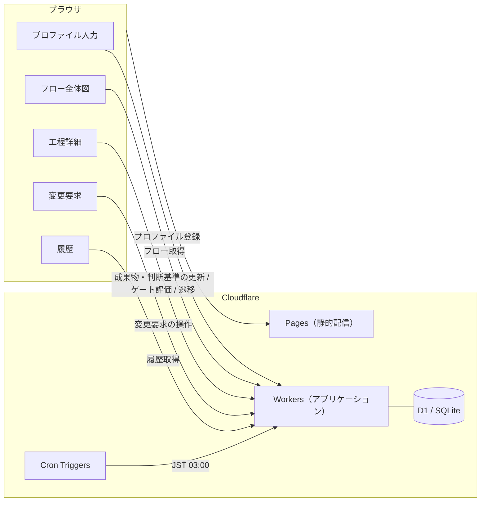
```mermaid
flowchart LR
  subgraph BR["ブラウザ"]
    UI1["プロファイル入力"]
    UI2["フロー全体図"]
    UI3["工程詳細"]
    UI4["変更要求"]
    UI5["履歴"]
  end

  subgraph CF["Cloudflare"]
    PG["Pages（静的配信）"]
    WK["Workers（アプリケーション）"]
    D1[("D1 / SQLite")]
    CR["Cron Triggers"]
  end

  BR --> PG
  UI1 -->|"プロファイル登録"| WK
  UI2 -->|"フロー取得"| WK
  UI3 -->|"成果物・判断基準の更新 / ゲート評価 / 遷移"| WK
  UI4 -->|"変更要求の操作"| WK
  UI5 -->|"履歴取得"| WK
  WK --- D1
  CR -->|"JST 03:00"| WK
```

---

## 6. 標準フローテンプレート仕様

### 6.1 全体方針

- フローは**工程マスタ**と**派生規則**から生成する。案件ごとに手で工程を追加・削除する操作は設けない
- 派生規則は決定的である。同一の案件プロファイルからは常に同一の工程列・成果物・判断基準が生成されること
- 各工程は、生成の根拠となった派生規則の識別子を保持し、画面上で「なぜこの工程・成果物・基準があるのか」を確認できること
- 成果物と判断基準は、契約形態に応じた**責任の所在**を反映する。請負は成果物の完成と検収、準委任は業務の遂行と報告を判定の中心に置く

### 6.2 案件プロファイル

| 項目 | 値 | 備考 |
|---|---|---|
| 契約形態 | 請負 / 準委任 / ハイブリッド | ハイブリッドは要件定義完了まで準委任、以降を請負とする |
| 業務種別 | 新規開発 / 改修 / 保守運用 / 調査 | 調査は PoC・技術検証を含む |
| 規模 | 小 / 中 / 大 | |
| 要件確定度 | 確定 / 未確定 | |

**不成立の組み合わせ**

| 組み合わせ | 扱い |
|---|---|
| ハイブリッド × 保守運用 | 受理しない。保守運用は要件定義を境とする契約の切替えを持たないため、契約形態を準委任または請負に変更するよう促す |

**警告を伴う組み合わせ**

警告は受理を妨げないが、フローに追加の成果物・判断基準を生成する（6.5 参照）。

| 組み合わせ | 警告の内容 | 推奨 |
|---|---|---|
| 請負 × 未確定 | 要件が未確定のまま請負契約を結ぶと、範囲と金額の前提が崩れやすい | ハイブリッド |
| 請負 × 保守運用 | 保守運用は業務の遂行が対価の対象であり、完成物の検収に馴染まない | 準委任 |

### 6.3 工程マスタ

| コード | 工程 | 既定のゲート種別 | 主な責任ロール |
|---|---|---|---|
| P01 | 引合・与件整理 | 内部レビュー | 受注 PM |
| P02 | 提案・見積 | 顧客承認 | 受注 PM |
| P03 | 契約締結 | 顧客承認 | 受注 PM・発注者決裁者 |
| P04 | 要件定義 | 顧客承認 | 受注 PM・発注者窓口 |
| P05 | 影響調査 | 顧客承認 | 受注担当 |
| P06 | 基本設計 | 顧客承認 | 受注担当 |
| P07 | 詳細設計 | 内部レビュー | 受注担当 |
| P08 | 実装 | 内部レビュー | 受注担当 |
| P09 | 結合テスト | 内部レビュー | 受注担当 |
| P10 | 総合テスト | 内部レビュー | 受注担当 |
| P11 | 受入テスト支援 | 顧客承認 | 発注者窓口 |
| P12 | リリース・移行 | 顧客承認 | 受注担当・発注者窓口 |
| P13 | 納品・検収 | 検収 | 受注 PM・発注者決裁者 |
| P14 | 業務完了報告 | 顧客承認 | 受注 PM・発注者窓口 |
| P15 | 保守運用サイクル | 顧客承認 | 受注担当・発注者窓口 |
| P16 | 調査実施 | 内部レビュー | 受注担当 |
| P17 | 報告書作成 | 顧客承認 | 受注 PM |
| P18 | クローズ | 内部レビュー | 受注 PM |

### 6.4 成果物マスタ

工程ごとの成果物と、既定の必須・任意の区分を示す。派生規則により必須へ昇格、または追加されるものは 6.5 に記載する。

| 工程 | 成果物 | 区分 | 作成ロール |
|---|---|---|---|
| P01 | 与件整理メモ | 必須 | 受注 PM |
| P01 | 課題・制約一覧 | 任意 | 受注 PM |
| P02 | 提案書 | 必須 | 受注 PM |
| P02 | 見積書 | 必須 | 受注 PM |
| P02 | 前提条件・除外事項一覧 | 必須 | 受注 PM |
| P02 | 体制図 | 任意 | 受注 PM |
| P03 | 契約書または注文書・注文請書 | 必須 | 受注 PM |
| P03 | 秘密保持契約 | 任意 | 受注 PM |
| P04 | 要件定義書 | 必須 | 受注 PM |
| P04 | 要件一覧 | 必須 | 受注担当 |
| P04 | 非機能要件一覧 | 任意 | 受注担当 |
| P04 | 変更管理手順 | 任意 | 受注 PM |
| P05 | 影響範囲一覧 | 必須 | 受注担当 |
| P05 | 現行仕様の確認記録 | 任意 | 受注担当 |
| P06 | 基本設計書 | 必須 | 受注担当 |
| P06 | 画面・帳票一覧 | 任意 | 受注担当 |
| P06 | 外部インターフェース定義 | 任意 | 受注担当 |
| P07 | 詳細設計書 | 必須 | 受注担当 |
| P07 | テスト計画書 | 必須 | 受注担当 |
| P08 | ソースコード | 必須 | 受注担当 |
| P08 | 単体テスト結果 | 必須 | 受注担当 |
| P08 | コードレビュー記録 | 任意 | 受注担当 |
| P09 | 結合テスト仕様書 | 必須 | 受注担当 |
| P09 | 結合テスト結果 | 必須 | 受注担当 |
| P10 | 総合テスト仕様書 | 必須 | 受注担当 |
| P10 | 総合テスト結果 | 必須 | 受注担当 |
| P10 | 不具合一覧 | 必須 | 受注担当 |
| P11 | 受入テスト支援記録 | 必須 | 受注担当 |
| P11 | 受入テスト結果（発注者作成） | 必須 | 発注者窓口 |
| P12 | リリース手順書 | 必須 | 受注担当 |
| P12 | 運用手引き | 任意 | 受注担当 |
| P13 | 納品物一覧 | 必須 | 受注 PM |
| P13 | 検収依頼書 | 必須 | 受注 PM |
| P13 | 検収書（発注者作成） | 必須 | 発注者決裁者 |
| P13 | 契約不適合対応期間の定義 | 必須 | 受注 PM |
| P14 | 業務報告書 | 必須 | 受注 PM |
| P14 | 工数実績 | 必須 | 受注 PM |
| P15 | 保守対応記録 | 必須（反復） | 受注担当 |
| P15 | 月次報告書 | 必須（反復） | 受注 PM |
| P16 | 調査記録 | 必須 | 受注担当 |
| P16 | 検証環境の構成記録 | 任意 | 受注担当 |
| P17 | 調査報告書 | 必須 | 受注 PM |
| P17 | 推奨事項・次段階の提案 | 任意 | 受注 PM |
| P18 | 振り返り記録 | 必須 | 受注 PM |
| P18 | 精算記録 | 任意 | 受注 PM |

### 6.5 派生規則

派生規則は R01 から順に適用する。後の規則は前の規則が生成した工程を変形してよい。

| 規則 | 条件 | 効果 |
|---|---|---|
| R01 | 常に | P01・P02・P03・P18 を生成する |
| R02 | 業務種別＝新規開発 | P04・P06・P07・P08・P09・P10・P11・P12 を生成する |
| R03 | 業務種別＝改修 | R02 と同じ工程に加え、P04 の直後に P05 を生成する。P09・P10 に「回帰テスト仕様」「回帰テスト結果」を必須成果物として追加し、P12 に「切戻し手順書」を必須成果物として追加する |
| R04 | 業務種別＝保守運用 | P04 を「保守要件定義」として生成し、成果物を「対応範囲定義」「SLA 定義書」「エスカレーション手順」に置き換える。設計・実装・テストの工程は生成せず、P15 を生成する |
| R05 | 業務種別＝調査 | P04 を「調査計画」として生成し、成果物を「調査計画書」「評価観点一覧」「報告書目次案」に置き換える。設計・実装・テストの工程は生成せず、P16・P17 を生成する |
| R06 | 契約形態＝請負 | 終端前の工程として P13 を生成する。P04 の判断基準に「検収基準の合意」を必須として追加する |
| R07 | 契約形態＝準委任 | 終端前の工程として P14 を生成する。検収ゲートは生成しない |
| R08 | 契約形態＝ハイブリッド | P03 を「契約締結（準委任）」として P04 の前に、「契約締結（請負）」として P04 の後に、2 回生成する。P04 の判断基準に「請負範囲・再見積の提示」を必須として追加する。P04 以前は準委任、以後は請負の規則を適用し、終端前は P13 とする |
| R09 | 規模＝小 | P06 と P07 を「設計」1 工程に、P09 と P10 を「テスト」1 工程に統合する。統合工程の成果物は両工程の必須成果物の和集合とし、ゲート種別は統合前のうち厳しい方（顧客承認）を採用する |
| R10 | 規模＝大 | 「週次進捗報告」を P04 以降の全工程に反復成果物として追加する。「課題管理表」を P04 以降の全工程に必須成果物として追加する。P12 に「移行計画書」「移行リハーサル結果」を必須成果物として追加する |
| R11 | 請負 × 未確定 | 警告を発する。P03 に「要件凍結合意書」を必須成果物として追加し、P04 の「変更管理手順」を必須へ昇格する |
| R12 | 準委任またはハイブリッド × 未確定 | P04 の判断基準に「要件一覧の優先度付け」を推奨として追加する |
| R13 | 請負 × 保守運用 | 警告を発する。P03 に「SLA 定義書」を必須成果物として追加し、P13 の検収対象を「月次報告書」「SLA 達成報告」とする |
| R14 | 請負 × 調査 | P04（調査計画）の「報告書目次案」「評価観点一覧」を検収基準として扱い、それらの合意を P04 の必須判断基準とする |
| R15 | 改修 × 小 | R09 の統合を適用したうえで、P05 を P04 に統合し、「影響範囲一覧」を P04 の必須成果物とする |
| R16 | ゲート種別＝顧客承認 の工程 | 「承認記録が存在する」を必須判断基準として自動付与する |
| R17 | P13 または P14 | 「持越し課題がゼロである」「未合意の変更要求がゼロである」を必須判断基準として自動付与する |
| R18 | ハイブリッド × 保守運用 | プロファイルを受理しない |

### 6.6 判断基準マスタ

工程ごとの判断基準と、既定の必須・推奨の区分を示す。成果物の状態に関する基準は、必須成果物が「承認済」（顧客承認・検収ゲート）または「レビュー済」（内部レビューゲート）であることを共通の必須基準とし、以下には工程固有の基準のみを記載する。

| 工程 | 判断基準 | 区分 |
|---|---|---|
| P01 | 顧客の目的と、成功とみなす状態が言語化されている | 必須 |
| P01 | 自社で受けるべきでない理由（技術・体制・期日）の有無が確認されている | 必須 |
| P01 | 競合・代替手段の有無が把握されている | 推奨 |
| P02 | 前提条件と除外事項が見積書と対応している | 必須 |
| P02 | 契約形態の選択理由が提案書に記載されている | 必須 |
| P02 | 見積の内訳が工程単位で説明可能である | 推奨 |
| P03 | 契約形態・範囲・金額・期間が提案内容と一致している | 必須 |
| P03 | 検収条件または業務完了条件が契約書に明記されている | 必須 |
| P03 | 秘密保持・知的財産の帰属が定められている | 推奨 |
| P04 | 要件一覧の各項目に採否が記録されている | 必須 |
| P04 | 除外事項が要件定義書に明記されている | 必須 |
| P04 | 非機能要件が数値または条件で記述されている | 推奨 |
| P05 | 影響範囲一覧が現行の構成要素を網羅している | 必須 |
| P05 | 影響範囲に対する発注者の確認が得られている | 必須 |
| P06 | 要件一覧の全項目が設計要素に対応付けられている | 必須 |
| P06 | 外部インターフェースの相手方との確認が済んでいる | 推奨 |
| P07 | 詳細設計書が基本設計書と矛盾しない | 必須 |
| P07 | テスト計画書がテストの段階と合否基準を定めている | 必須 |
| P08 | 単体テストが全て完了し、未解決の失敗がない | 必須 |
| P08 | コードレビューが実施されている | 推奨 |
| P09 | 結合テストの未解決不具合に重大なものがない | 必須 |
| P09 | 結合テストの実施率が計画に達している | 推奨 |
| P10 | 総合テストの未解決不具合に重大なものがない | 必須 |
| P10 | 不具合一覧の未解決分に対する扱いが発注者と合意されている | 必須 |
| P11 | 発注者による受入テスト結果が受領されている | 必須 |
| P11 | 受入テストで検出された不具合の対応方針が合意されている | 必須 |
| P12 | リリース手順書に基づくリハーサルまたは事前確認が完了している | 必須 |
| P12 | 切戻しの判断基準と手順が定められている | 推奨 |
| P13 | 納品物一覧と実際の納品物が一致している | 必須 |
| P13 | 検収書が受領されている | 必須 |
| P13 | 契約不適合対応期間の起算日が記録されている | 必須 |
| P14 | 業務報告書が契約期間の全てを覆っている | 必須 |
| P14 | 工数実績が契約の上限内、または超過の合意がある | 必須 |
| P15 | 当月の保守対応記録が全件記録されている | 必須（反復） |
| P15 | 月次報告書が発注者に承認されている | 必須（反復） |
| P15 | SLA の達成状況が報告されている | 推奨（反復） |
| P16 | 調査計画の評価観点が全て検証されている | 必須 |
| P16 | 検証の再現手順が記録されている | 推奨 |
| P17 | 報告書が報告書目次案に沿っている | 必須 |
| P17 | 結論と根拠（調査記録）が対応付けられている | 必須 |
| P18 | 振り返り記録に、次案件へ引き継ぐ事項が記録されている | 必須 |
| P18 | 精算（工数・費用）が完了している | 推奨 |

### 6.7 マスタデータ件数

| 区分 | 件数 |
|---|---|
| 契約形態 | 3 |
| 業務種別 | 4 |
| 規模 | 3 |
| 要件確定度 | 2 |
| 工程 | 18 |
| 成果物 | 48 |
| 判断基準（工程固有） | 44 |
| 判断基準（自動付与） | 3 |
| 派生規則 | 18 |
| ゲート種別 | 3 |
| 判定結果 | 3 |
| ロール | 4 |
| 成果物状態 | 5 |
| 工程状態 | 7 |
| 変更要求状態 | 5 |

---

## 7. ゲート判定仕様

### 7.1 判定規則

工程のゲートは、当該工程の全判断基準のチェック状態から、次の順に判定する。

| 順 | 条件 | 判定 |
|---|---|---|
| 1 | 必須基準に 1 つでも未達がある | **不通過** |
| 2 | 必須基準が全て達成され、推奨基準に未達がある | **条件付き通過** |
| 3 | 必須基準・推奨基準が全て達成されている | **通過** |

**要件**

- 判定は判断基準のチェック状態のみから導かれること。判定の入力に人手による上書きを設けないこと
- 不通過の判定結果には、未達の必須基準を全て列挙すること
- 条件付き通過の判定結果には、未達の推奨基準を全て列挙し、それらを**持越し課題**として登録すること
- 顧客承認ゲートおよび検収ゲートでは、承認記録（承認ロール・承認日）の存在が必須基準であり、これが無い場合は他の基準の達成状況によらず不通過とすること
- 判定の実行は、工程が「進行中」または「ゲート評価待ち」の場合に限ること

### 7.2 持越し課題

- 持越し課題は、発生元の工程を保持したまま案件に紐づき、後続の全工程で参照できること
- 持越し課題の解決は明示的な操作で記録し、解決時点の工程を保持すること
- 終端前の工程（P13 または P14）のゲートでは、未解決の持越し課題が 1 件でもあれば不通過とすること（R17）
- 持越し課題は差戻しによって消滅しない。差戻し先の工程で解決してもよい

### 7.3 成果物状態と判断基準の関係

| ゲート種別 | 必須成果物に求める状態 |
|---|---|
| 内部レビュー | レビュー済 以上 |
| 顧客承認 | 承認済 |
| 検収 | 承認済 |

- 任意成果物の状態は判定に影響しないこと
- 反復成果物（週次進捗報告・保守対応記録・月次報告書）は、当該周期分が対象状態にあることを求め、過去周期分は判定に含めないこと

---

## 8. 工程遷移・変更管理仕様

### 8.1 前進

- 前進は、現工程のゲートが「通過」または「条件付き通過」と判定された場合にのみ行えること
- 前進後、次工程は「未着手」から「進行中」へ遷移し、現工程は判定結果に応じて「通過」または「条件付き通過」で確定すること
- 工程の飛ばしは行えないこと

### 8.2 差戻し

- 差戻しは、現工程から任意の過去工程へ行えること。差戻しには理由の記録を必須とすること
- 差戻し区間（差戻し先から現工程まで）の全工程は「要再確認」となり、区間内の全成果物は「要更新」となること
- 要再確認の工程は、成果物を再び所定の状態にし、ゲートを再判定して前進すること。再判定は通常の判定規則に従う
- 差戻しは遷移履歴に記録し、差戻し先・差戻し元・理由を保持すること

### 8.3 中止

- 中止は、案件が「進行中」であれば任意の工程から行えること。理由の記録を必須とすること
- 中止後は P18（クローズ）のみが進行可能となり、他の工程は操作不能となること
- 中止した案件では、P18 の「精算が完了している」を必須へ昇格すること

### 8.4 変更要求

変更要求は、P03（契約締結）の通過以降、案件が進行中である間、任意の工程で起票できる。

| 状態 | 内容 | 次の状態 |
|---|---|---|
| 起票 | 変更内容と起票元工程を記録する | 影響評価中 |
| 影響評価中 | 工数・納期・金額への影響の有無を記録する | 合意待ち |
| 合意待ち | 発注者との合意結果を記録する | 反映済 / 却下 |
| 反映済 | 影響を受ける成果物を「要更新」にする | （終端） |
| 却下 | 理由を記録する | （終端） |

**要件**

- 契約形態が請負（ハイブリッドの請負区間を含む）で、金額または納期に影響がある変更要求を反映する場合、「契約変更覚書」を P03 の成果物として追加し、必須とすること
- 契約形態が準委任で反映する場合、工数見積の更新を記録すること。契約変更覚書は求めない
- 反映により「要更新」となった成果物は、所属工程が通過済みであっても、当該成果物が所定の状態に戻るまで終端前工程（P13 または P14）のゲートを不通過とすること
- 未合意（起票・影響評価中・合意待ち）の変更要求が 1 件でもある場合、終端前工程のゲートは不通過とすること（R17）
- 変更要求の起票元工程と影響先の成果物は、履歴から追跡できること

### 8.5 保守運用サイクル

- P15 は月次を周期として反復し、周期ごとに受付・切り分け・対応・報告の 4 段階を持つこと
- 周期の完了は、当該周期の月次報告書が承認済であることをもって判定すること
- 契約期間の満了、または中止により反復を終了し、終端前工程へ前進すること
- 周期内の各段階は保守対応記録の単位で記録し、周期をまたぐ未完了の対応は次周期へ引き継ぐこと

### 8.6 再現性

- 同一の案件プロファイルから展開されるフローは、工程列・成果物・判断基準・ゲート種別・適用規則の全てが一致すること
- 派生規則の適用結果は工程ごとに規則識別子として保存し、画面から参照できること

---

## 9. 画面仕様

### 9.1 プロファイル入力画面

| 領域 | 内容 |
|---|---|
| 案件ラベル | 任意の識別用ラベル。実在の顧客名・個人名を含めない旨を表示する |
| プロファイル | 契約形態・業務種別・規模・要件確定度をそれぞれ単一選択で入力する |
| 検証結果 | 不成立の組み合わせの場合は登録不可と理由を表示する。警告を伴う組み合わせの場合は警告と推奨を表示し、続行を選択できる |
| 展開プレビュー | 登録前に、生成される工程列とゲート種別を一覧で表示する |

### 9.2 フロー全体図画面

| 領域 | 内容 |
|---|---|
| 工程列 | 工程を順に並べ、各工程の状態・ゲート種別・必須成果物数・判断基準の達成数を表示する。現工程を強調する |
| 契約区間 | ハイブリッドの場合、準委任区間と請負区間の境界を表示する |
| 根拠表示 | 各工程に適用された派生規則を展開表示する |
| 警告 | プロファイル登録時の警告を常時表示する |
| 持越し課題・変更要求 | 未解決の持越し課題数と未合意の変更要求数を表示する |

### 9.3 工程詳細画面

| 領域 | 内容 |
|---|---|
| 成果物 | 成果物ごとに区分・作成ロール・状態を表示し、状態を更新する |
| 判断基準 | 判断基準ごとに区分と達成状態を表示し、達成状態を更新する。自動付与された基準はその旨を表示する |
| 承認記録 | 顧客承認・検収ゲートの場合、承認ロールと承認日を記録する |
| ゲート評価 | 判定を実行し、判定結果と未達基準の一覧を表示する |
| 遷移操作 | 前進・差戻し（差戻し先と理由を入力）・中止（理由を入力） |
| 保守運用サイクル | P15 の場合、当月周期の 4 段階と保守対応記録の一覧を表示する |

### 9.4 変更要求画面

| 領域 | 内容 |
|---|---|
| 一覧 | 変更要求を状態別に表示する |
| 起票 | 変更内容を入力する。起票元工程は現工程を自動設定する |
| 影響評価 | 工数・納期・金額への影響の有無と、影響を受ける成果物を選択する |
| 合意 | 合意または却下を記録する。請負で金額・納期に影響がある場合、契約変更覚書の追加を表示する |

### 9.5 履歴画面

| 領域 | 内容 |
|---|---|
| 遷移履歴 | 前進・差戻し・中止を時系列で表示する |
| 判定履歴 | ゲート判定の結果と未達基準を時系列で表示する |
| 変更要求履歴 | 変更要求の状態遷移を時系列で表示する |

---

## 10. データ設計

### 10.1 テーブル一覧

| テーブル | 用途 |
|---|---|
| sessions | ブラウザごとのセッション |
| projects | 案件 1 件（プロファイルと案件状態） |
| project_warnings | プロファイル登録時の警告 |
| phases | 案件に展開された工程 |
| phase_rules | 工程に適用された派生規則 |
| deliverables | 工程に紐づく成果物と状態 |
| criteria | 工程に紐づく判断基準と達成状態 |
| approvals | 顧客承認・検収ゲートの承認記録 |
| gate_reviews | ゲート判定の結果 |
| carryover_issues | 持越し課題 |
| change_requests | 変更要求 |
| change_request_impacts | 変更要求が影響する成果物 |
| maintenance_cycles | 保守運用サイクルの周期 |
| maintenance_records | 保守対応記録 |
| transitions | 前進・差戻し・中止の遷移履歴 |

マスタ（工程・成果物・判断基準・派生規則・区分値）はアプリケーションに同梱する固定データとし、DB には案件ごとに展開した結果のみを保存する。

すべてのテーブルは `session_id` を保持し、オーナーキーとして参照条件に必ず含める。

---

## 11. ER図

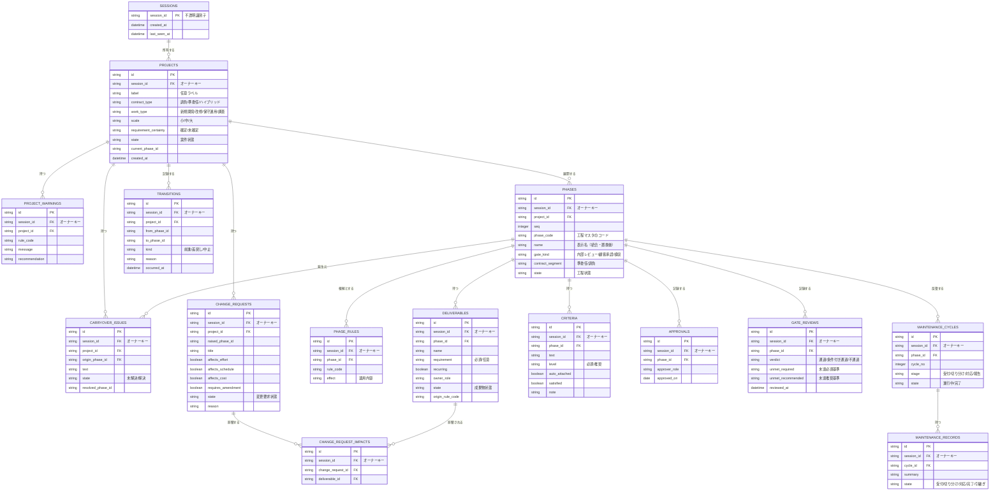
```mermaid
erDiagram
  SESSIONS ||--o{ PROJECTS : "所有する"
  PROJECTS ||--o{ PROJECT_WARNINGS : "持つ"
  PROJECTS ||--o{ PHASES : "展開する"
  PROJECTS ||--o{ CARRYOVER_ISSUES : "持つ"
  PROJECTS ||--o{ CHANGE_REQUESTS : "持つ"
  PROJECTS ||--o{ TRANSITIONS : "記録する"
  PHASES ||--o{ PHASE_RULES : "根拠とする"
  PHASES ||--o{ DELIVERABLES : "持つ"
  PHASES ||--o{ CRITERIA : "持つ"
  PHASES ||--o{ APPROVALS : "記録する"
  PHASES ||--o{ GATE_REVIEWS : "記録する"
  PHASES ||--o{ MAINTENANCE_CYCLES : "反復する"
  MAINTENANCE_CYCLES ||--o{ MAINTENANCE_RECORDS : "持つ"
  CHANGE_REQUESTS ||--o{ CHANGE_REQUEST_IMPACTS : "影響する"
  DELIVERABLES ||--o{ CHANGE_REQUEST_IMPACTS : "影響される"
  PHASES ||--o{ CARRYOVER_ISSUES : "発生元"

  SESSIONS {
    string session_id PK "不透明識別子"
    datetime created_at
    datetime last_seen_at
  }

  PROJECTS {
    string id PK
    string session_id FK "オーナーキー"
    string label "任意ラベル"
    string contract_type "請負/準委任/ハイブリッド"
    string work_type "新規開発/改修/保守運用/調査"
    string scale "小/中/大"
    string requirement_certainty "確定/未確定"
    string state "案件状態"
    string current_phase_id
    datetime created_at
  }

  PROJECT_WARNINGS {
    string id PK
    string session_id FK "オーナーキー"
    string project_id FK
    string rule_code
    string message
    string recommendation
  }

  PHASES {
    string id PK
    string session_id FK "オーナーキー"
    string project_id FK
    integer seq
    string phase_code "工程マスタのコード"
    string name "表示名（統合・置換後）"
    string gate_kind "内部レビュー/顧客承認/検収"
    string contract_segment "準委任/請負"
    string state "工程状態"
  }

  PHASE_RULES {
    string id PK
    string session_id FK "オーナーキー"
    string phase_id FK
    string rule_code
    string effect "適用内容"
  }

  DELIVERABLES {
    string id PK
    string session_id FK "オーナーキー"
    string phase_id FK
    string name
    string requirement "必須/任意"
    boolean recurring
    string owner_role
    string state "成果物状態"
    string origin_rule_code
  }

  CRITERIA {
    string id PK
    string session_id FK "オーナーキー"
    string phase_id FK
    string text
    string level "必須/推奨"
    boolean auto_attached
    boolean satisfied
    string note
  }

  APPROVALS {
    string id PK
    string session_id FK "オーナーキー"
    string phase_id FK
    string approver_role
    date approved_on
  }

  GATE_REVIEWS {
    string id PK
    string session_id FK "オーナーキー"
    string phase_id FK
    string verdict "通過/条件付き通過/不通過"
    string unmet_required "未達必須基準"
    string unmet_recommended "未達推奨基準"
    datetime reviewed_at
  }

  CARRYOVER_ISSUES {
    string id PK
    string session_id FK "オーナーキー"
    string project_id FK
    string origin_phase_id FK
    string text
    string state "未解決/解決"
    string resolved_phase_id
  }

  CHANGE_REQUESTS {
    string id PK
    string session_id FK "オーナーキー"
    string project_id FK
    string raised_phase_id
    string title
    boolean affects_effort
    boolean affects_schedule
    boolean affects_cost
    boolean requires_amendment
    string state "変更要求状態"
    string reason
  }

  CHANGE_REQUEST_IMPACTS {
    string id PK
    string session_id FK "オーナーキー"
    string change_request_id FK
    string deliverable_id FK
  }

  MAINTENANCE_CYCLES {
    string id PK
    string session_id FK "オーナーキー"
    string phase_id FK
    integer cycle_no
    string stage "受付/切り分け/対応/報告"
    string state "進行中/完了"
  }

  MAINTENANCE_RECORDS {
    string id PK
    string session_id FK "オーナーキー"
    string cycle_id FK
    string summary
    string state "受付/切り分け/対応/完了/引継ぎ"
  }

  TRANSITIONS {
    string id PK
    string session_id FK "オーナーキー"
    string project_id FK
    string from_phase_id
    string to_phase_id
    string kind "前進/差戻し/中止"
    string reason
    datetime occurred_at
  }
```

---

## 12. DFD

### 12.1 コンテキストレベル

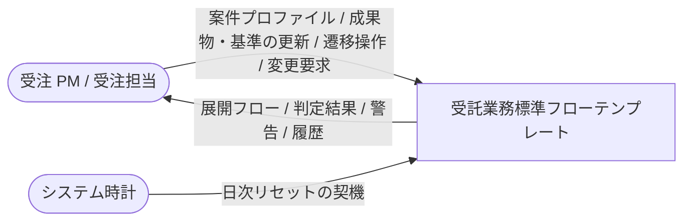
```mermaid
flowchart LR
  PM(["受注 PM / 受注担当"])
  CK(["システム時計"])

  P0["受託業務標準フローテンプレート"]

  PM -->|"案件プロファイル / 成果物・基準の更新 / 遷移操作 / 変更要求"| P0
  P0 -->|"展開フロー / 判定結果 / 警告 / 履歴"| PM
  CK -->|"日次リセットの契機"| P0
```

### 12.2 詳細レベル

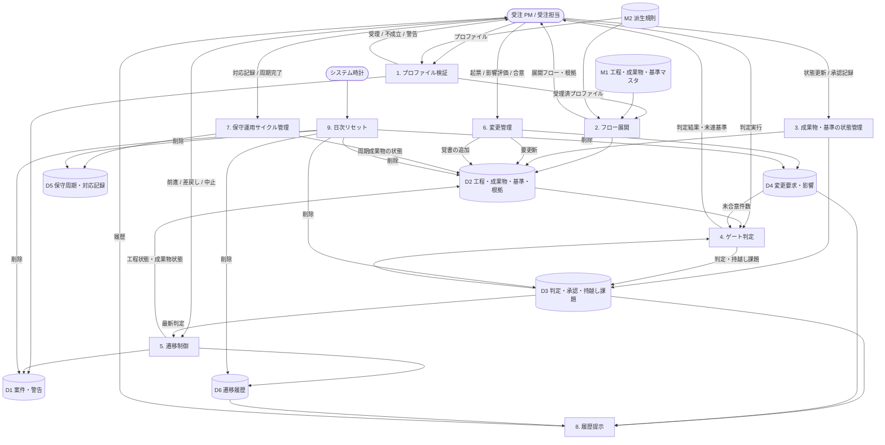
```mermaid
flowchart TB
  PM(["受注 PM / 受注担当"])
  CK(["システム時計"])

  P1["1. プロファイル検証"]
  P2["2. フロー展開"]
  P3["3. 成果物・基準の状態管理"]
  P4["4. ゲート判定"]
  P5["5. 遷移制御"]
  P6["6. 変更管理"]
  P7["7. 保守運用サイクル管理"]
  P8["8. 履歴提示"]
  P9["9. 日次リセット"]

  M1[("M1 工程・成果物・基準マスタ")]
  M2[("M2 派生規則")]
  D1[("D1 案件・警告")]
  D2[("D2 工程・成果物・基準・根拠")]
  D3[("D3 判定・承認・持越し課題")]
  D4[("D4 変更要求・影響")]
  D5[("D5 保守周期・対応記録")]
  D6[("D6 遷移履歴")]

  PM -->|"プロファイル"| P1
  M2 --> P1
  P1 -->|"受理 / 不成立 / 警告"| PM
  P1 -->|"受理済プロファイル"| P2
  P1 --> D1
  M1 --> P2
  M2 --> P2
  P2 --> D2
  P2 -->|"展開フロー・根拠"| PM

  PM -->|"状態更新 / 承認記録"| P3
  P3 --> D2
  P3 --> D3

  PM -->|"判定実行"| P4
  D2 --> P4
  D3 --> P4
  D4 -->|"未合意件数"| P4
  P4 -->|"判定結果・未達基準"| PM
  P4 -->|"判定・持越し課題"| D3

  PM -->|"前進 / 差戻し / 中止"| P5
  D3 -->|"最新判定"| P5
  P5 -->|"工程状態・成果物状態"| D2
  P5 --> D6
  P5 --> D1

  PM -->|"起票 / 影響評価 / 合意"| P6
  P6 --> D4
  P6 -->|"要更新"| D2
  P6 -->|"覚書の追加"| D2

  PM -->|"対応記録 / 周期完了"| P7
  P7 --> D5
  P7 -->|"周期成果物の状態"| D2

  D3 --> P8
  D4 --> P8
  D6 --> P8
  P8 -->|"履歴"| PM

  CK --> P9
  P9 -->|"削除"| D1
  P9 -->|"削除"| D2
  P9 -->|"削除"| D3
  P9 -->|"削除"| D4
  P9 -->|"削除"| D5
  P9 -->|"削除"| D6
```

---

## 13. シーケンス図

### 13.1 案件登録とフロー展開

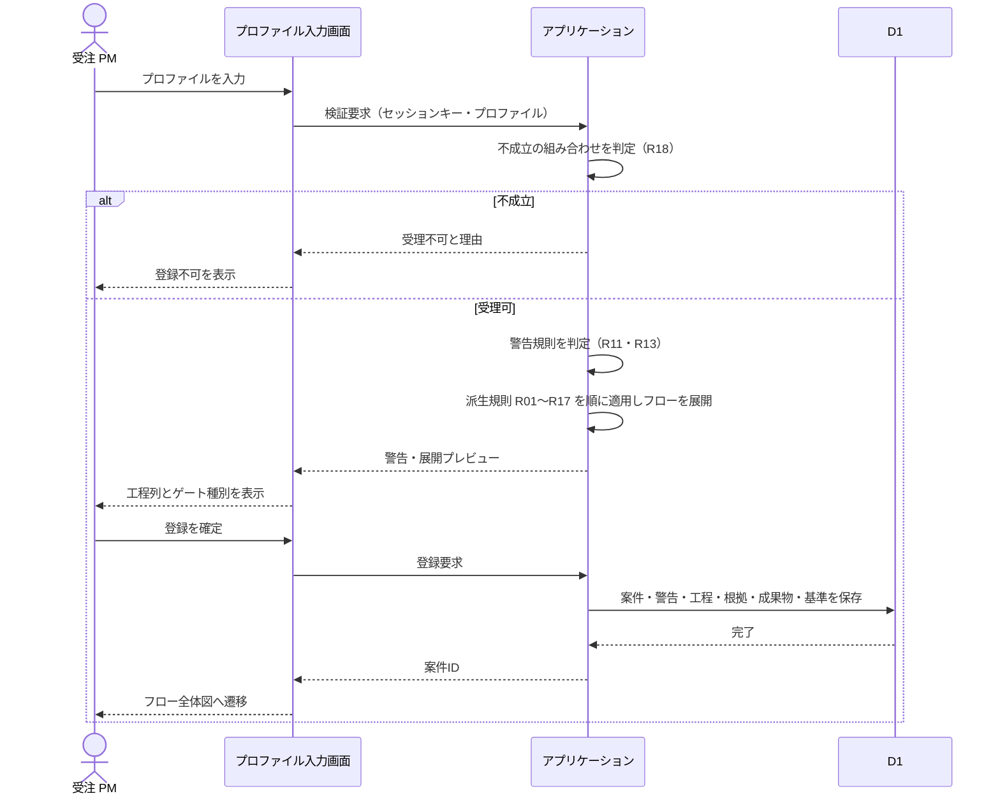
```mermaid
sequenceDiagram
  actor PM as 受注 PM
  participant UI as プロファイル入力画面
  participant AP as アプリケーション
  participant DB as D1

  PM->>UI: プロファイルを入力
  UI->>AP: 検証要求（セッションキー・プロファイル）
  AP->>AP: 不成立の組み合わせを判定（R18）
  alt 不成立
    AP-->>UI: 受理不可と理由
    UI-->>PM: 登録不可を表示
  else 受理可
    AP->>AP: 警告規則を判定（R11・R13）
    AP->>AP: 派生規則 R01〜R17 を順に適用しフローを展開
    AP-->>UI: 警告・展開プレビュー
    UI-->>PM: 工程列とゲート種別を表示
    PM->>UI: 登録を確定
    UI->>AP: 登録要求
    AP->>DB: 案件・警告・工程・根拠・成果物・基準を保存
    DB-->>AP: 完了
    AP-->>UI: 案件ID
    UI-->>PM: フロー全体図へ遷移
  end
```

### 13.2 ゲート判定と前進

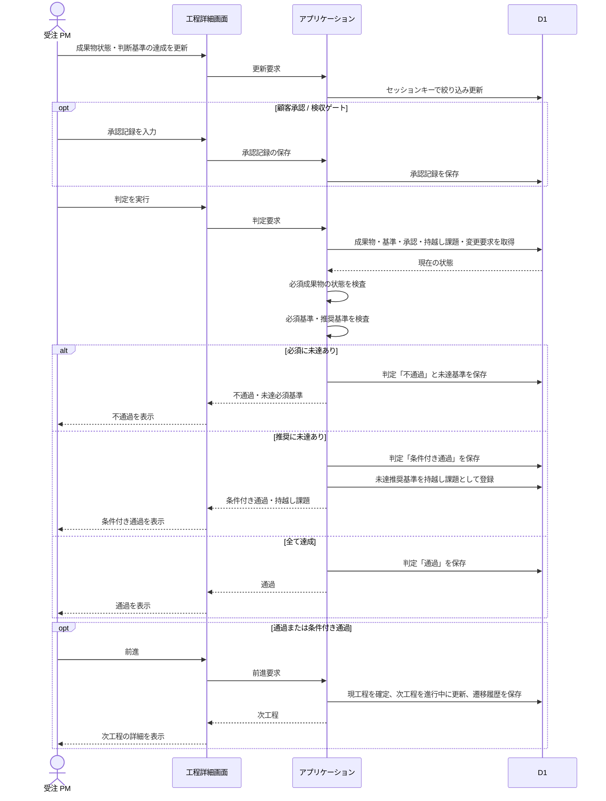
```mermaid
sequenceDiagram
  actor PM as 受注 PM
  participant UI as 工程詳細画面
  participant AP as アプリケーション
  participant DB as D1

  PM->>UI: 成果物状態・判断基準の達成を更新
  UI->>AP: 更新要求
  AP->>DB: セッションキーで絞り込み更新
  opt 顧客承認 / 検収ゲート
    PM->>UI: 承認記録を入力
    UI->>AP: 承認記録の保存
    AP->>DB: 承認記録を保存
  end

  PM->>UI: 判定を実行
  UI->>AP: 判定要求
  AP->>DB: 成果物・基準・承認・持越し課題・変更要求を取得
  DB-->>AP: 現在の状態
  AP->>AP: 必須成果物の状態を検査
  AP->>AP: 必須基準・推奨基準を検査
  alt 必須に未達あり
    AP->>DB: 判定「不通過」と未達基準を保存
    AP-->>UI: 不通過・未達必須基準
    UI-->>PM: 不通過を表示
  else 推奨に未達あり
    AP->>DB: 判定「条件付き通過」を保存
    AP->>DB: 未達推奨基準を持越し課題として登録
    AP-->>UI: 条件付き通過・持越し課題
    UI-->>PM: 条件付き通過を表示
  else 全て達成
    AP->>DB: 判定「通過」を保存
    AP-->>UI: 通過
    UI-->>PM: 通過を表示
  end

  opt 通過または条件付き通過
    PM->>UI: 前進
    UI->>AP: 前進要求
    AP->>DB: 現工程を確定、次工程を進行中に更新、遷移履歴を保存
    AP-->>UI: 次工程
    UI-->>PM: 次工程の詳細を表示
  end
```

### 13.3 差戻し

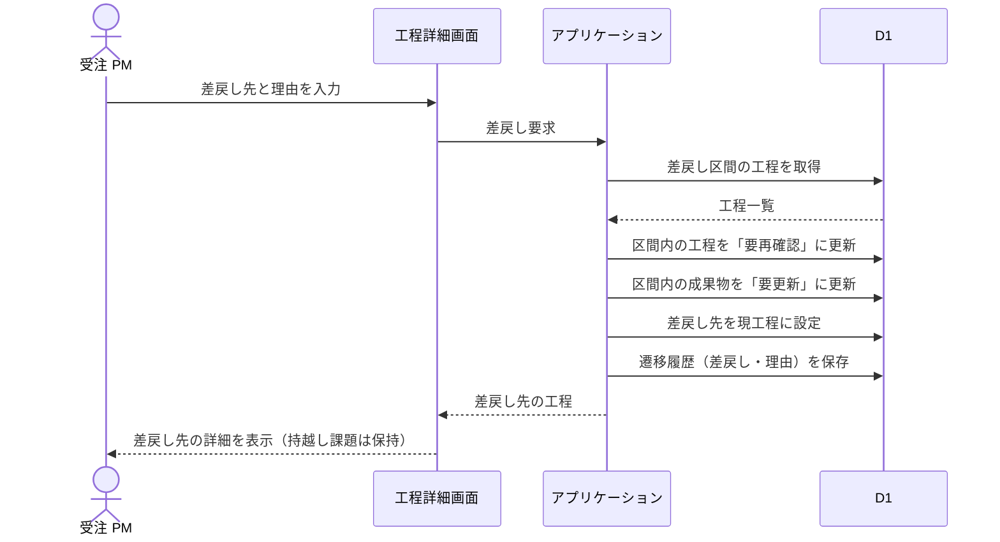
```mermaid
sequenceDiagram
  actor PM as 受注 PM
  participant UI as 工程詳細画面
  participant AP as アプリケーション
  participant DB as D1

  PM->>UI: 差戻し先と理由を入力
  UI->>AP: 差戻し要求
  AP->>DB: 差戻し区間の工程を取得
  DB-->>AP: 工程一覧
  AP->>DB: 区間内の工程を「要再確認」に更新
  AP->>DB: 区間内の成果物を「要更新」に更新
  AP->>DB: 差戻し先を現工程に設定
  AP->>DB: 遷移履歴（差戻し・理由）を保存
  AP-->>UI: 差戻し先の工程
  UI-->>PM: 差戻し先の詳細を表示（持越し課題は保持）
```

### 13.4 変更要求

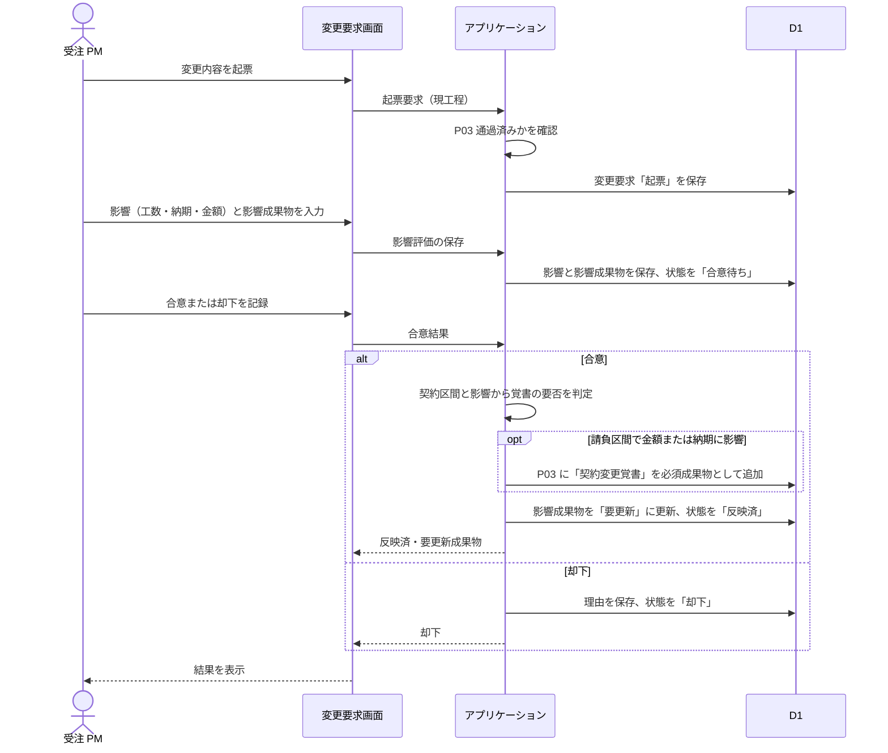
```mermaid
sequenceDiagram
  actor PM as 受注 PM
  participant UI as 変更要求画面
  participant AP as アプリケーション
  participant DB as D1

  PM->>UI: 変更内容を起票
  UI->>AP: 起票要求（現工程）
  AP->>AP: P03 通過済みかを確認
  AP->>DB: 変更要求「起票」を保存
  PM->>UI: 影響（工数・納期・金額）と影響成果物を入力
  UI->>AP: 影響評価の保存
  AP->>DB: 影響と影響成果物を保存、状態を「合意待ち」
  PM->>UI: 合意または却下を記録
  UI->>AP: 合意結果
  alt 合意
    AP->>AP: 契約区間と影響から覚書の要否を判定
    opt 請負区間で金額または納期に影響
      AP->>DB: P03 に「契約変更覚書」を必須成果物として追加
    end
    AP->>DB: 影響成果物を「要更新」に更新、状態を「反映済」
    AP-->>UI: 反映済・要更新成果物
  else 却下
    AP->>DB: 理由を保存、状態を「却下」
    AP-->>UI: 却下
  end
  UI-->>PM: 結果を表示
```

### 13.5 日次リセット

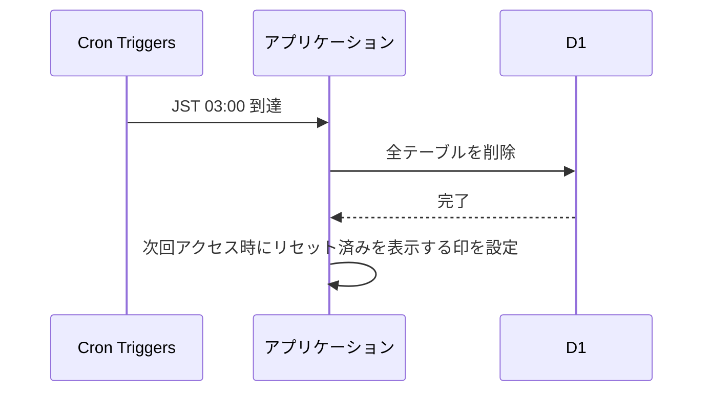
```mermaid
sequenceDiagram
  participant CK as Cron Triggers
  participant AP as アプリケーション
  participant DB as D1

  CK->>AP: JST 03:00 到達
  AP->>DB: 全テーブルを削除
  DB-->>AP: 完了
  AP->>AP: 次回アクセス時にリセット済みを表示する印を設定
```

---

## 14. クラス図

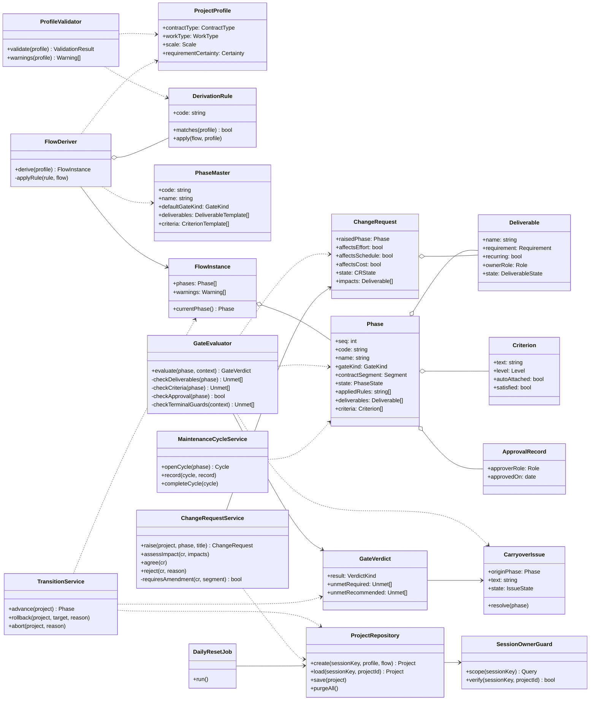
```mermaid
classDiagram
  direction LR

  class ProjectProfile {
    +contractType: ContractType
    +workType: WorkType
    +scale: Scale
    +requirementCertainty: Certainty
  }

  class ProfileValidator {
    +validate(profile) ValidationResult
    +warnings(profile) Warning[]
  }

  class FlowDeriver {
    +derive(profile) FlowInstance
    -applyRule(rule, flow)
  }

  class DerivationRule {
    +code: string
    +matches(profile) bool
    +apply(flow, profile)
  }

  class PhaseMaster {
    +code: string
    +name: string
    +defaultGateKind: GateKind
    +deliverables: DeliverableTemplate[]
    +criteria: CriterionTemplate[]
  }

  class FlowInstance {
    +phases: Phase[]
    +warnings: Warning[]
    +currentPhase() Phase
  }

  class Phase {
    +seq: int
    +code: string
    +name: string
    +gateKind: GateKind
    +contractSegment: Segment
    +state: PhaseState
    +appliedRules: string[]
    +deliverables: Deliverable[]
    +criteria: Criterion[]
  }

  class Deliverable {
    +name: string
    +requirement: Requirement
    +recurring: bool
    +ownerRole: Role
    +state: DeliverableState
  }

  class Criterion {
    +text: string
    +level: Level
    +autoAttached: bool
    +satisfied: bool
  }

  class ApprovalRecord {
    +approverRole: Role
    +approvedOn: date
  }

  class GateEvaluator {
    +evaluate(phase, context) GateVerdict
    -checkDeliverables(phase) Unmet[]
    -checkCriteria(phase) Unmet[]
    -checkApproval(phase) bool
    -checkTerminalGuards(context) Unmet[]
  }

  class GateVerdict {
    +result: VerdictKind
    +unmetRequired: Unmet[]
    +unmetRecommended: Unmet[]
  }

  class CarryoverIssue {
    +originPhase: Phase
    +text: string
    +state: IssueState
    +resolve(phase)
  }

  class TransitionService {
    +advance(project) Phase
    +rollback(project, target, reason)
    +abort(project, reason)
  }

  class ChangeRequest {
    +raisedPhase: Phase
    +affectsEffort: bool
    +affectsSchedule: bool
    +affectsCost: bool
    +state: CRState
    +impacts: Deliverable[]
  }

  class ChangeRequestService {
    +raise(project, phase, title) ChangeRequest
    +assessImpact(cr, impacts)
    +agree(cr)
    +reject(cr, reason)
    -requiresAmendment(cr, segment) bool
  }

  class MaintenanceCycleService {
    +openCycle(phase) Cycle
    +record(cycle, record)
    +completeCycle(cycle)
  }

  class ProjectRepository {
    +create(sessionKey, profile, flow) Project
    +load(sessionKey, projectId) Project
    +save(project)
    +purgeAll()
  }

  class SessionOwnerGuard {
    +scope(sessionKey) Query
    +verify(sessionKey, projectId) bool
  }

  class DailyResetJob {
    +run()
  }

  ProfileValidator ..> ProjectProfile
  ProfileValidator ..> DerivationRule
  FlowDeriver ..> ProjectProfile
  FlowDeriver o-- DerivationRule
  FlowDeriver ..> PhaseMaster
  FlowDeriver --> FlowInstance
  FlowInstance o-- Phase
  Phase o-- Deliverable
  Phase o-- Criterion
  Phase o-- ApprovalRecord
  GateEvaluator ..> Phase
  GateEvaluator --> GateVerdict
  GateEvaluator ..> CarryoverIssue
  GateEvaluator ..> ChangeRequest
  GateVerdict --> CarryoverIssue
  TransitionService ..> GateVerdict
  TransitionService ..> FlowInstance
  ChangeRequestService --> ChangeRequest
  ChangeRequest o-- Deliverable
  MaintenanceCycleService ..> Phase
  ProjectRepository --> SessionOwnerGuard
  TransitionService ..> ProjectRepository
  ChangeRequestService ..> ProjectRepository
  DailyResetJob --> ProjectRepository
```

---

## 15. 状態遷移図

### 15.1 案件

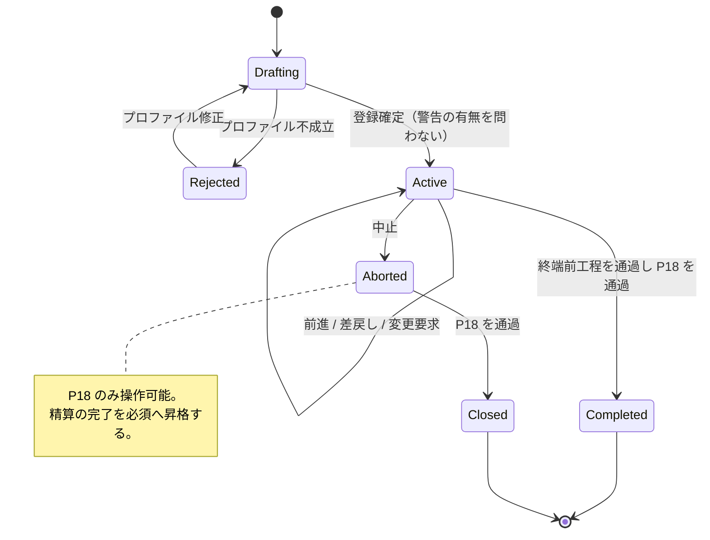
```mermaid
stateDiagram-v2
  [*] --> Drafting
  Drafting --> Rejected : プロファイル不成立
  Drafting --> Active : 登録確定（警告の有無を問わない）
  Rejected --> Drafting : プロファイル修正
  Active --> Active : 前進 / 差戻し / 変更要求
  Active --> Aborted : 中止
  Aborted --> Closed : P18 を通過
  Active --> Completed : 終端前工程を通過し P18 を通過
  Completed --> [*]
  Closed --> [*]

  note right of Aborted
    P18 のみ操作可能。
    精算の完了を必須へ昇格する。
  end note
```

### 15.2 工程

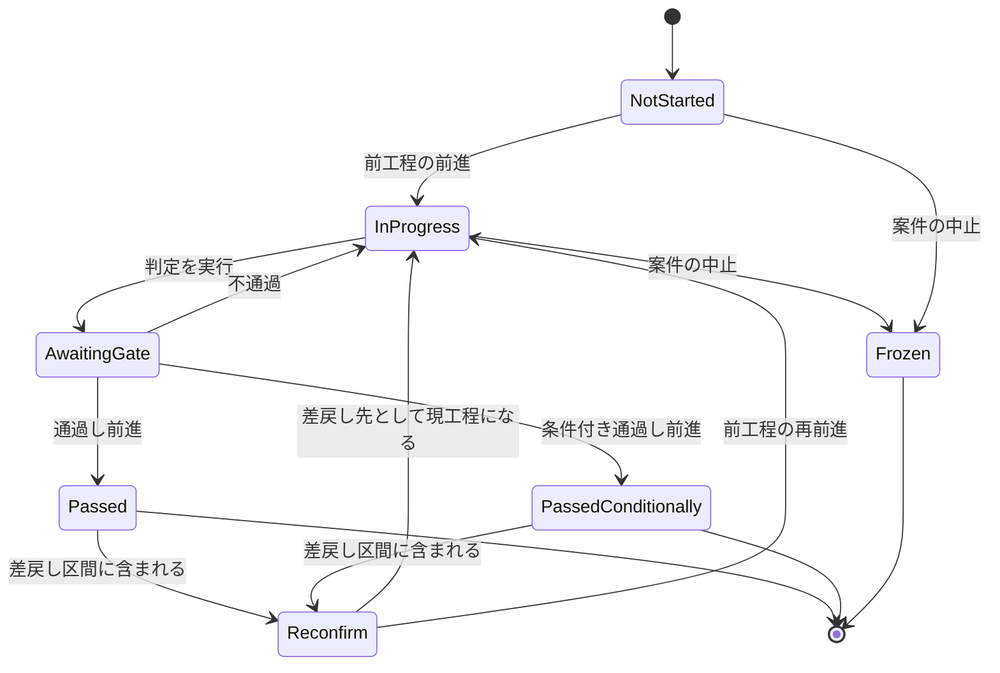
```mermaid
stateDiagram-v2
  [*] --> NotStarted
  NotStarted --> InProgress : 前工程の前進
  InProgress --> AwaitingGate : 判定を実行
  AwaitingGate --> InProgress : 不通過
  AwaitingGate --> Passed : 通過し前進
  AwaitingGate --> PassedConditionally : 条件付き通過し前進
  Passed --> Reconfirm : 差戻し区間に含まれる
  PassedConditionally --> Reconfirm : 差戻し区間に含まれる
  Reconfirm --> InProgress : 差戻し先として現工程になる
  Reconfirm --> InProgress : 前工程の再前進
  InProgress --> Frozen : 案件の中止
  NotStarted --> Frozen : 案件の中止
  Passed --> [*]
  PassedConditionally --> [*]
  Frozen --> [*]
```

### 15.3 成果物

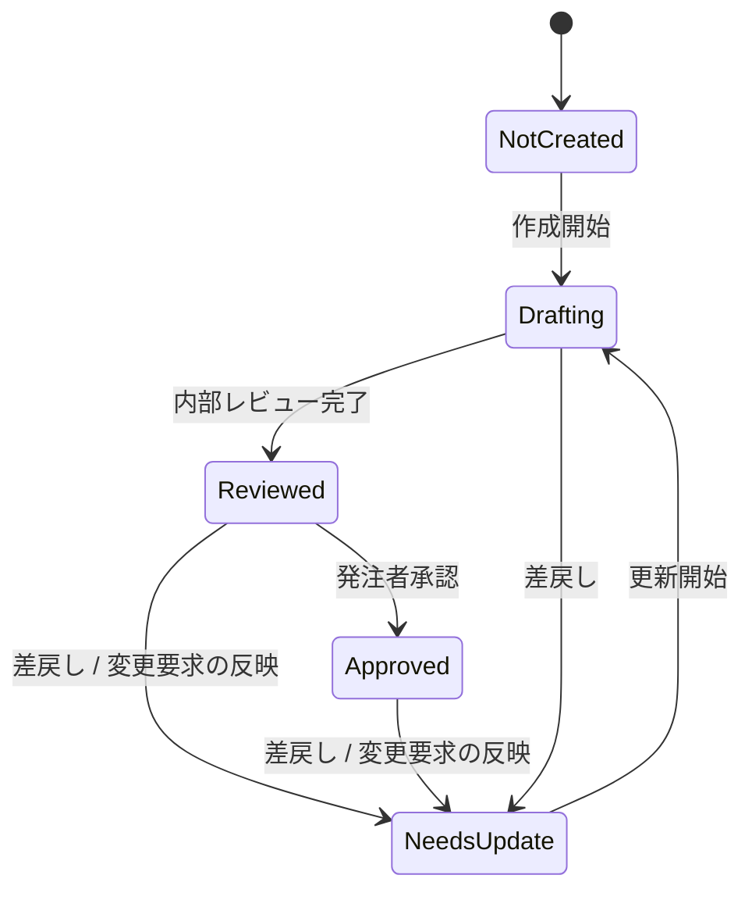
```mermaid
stateDiagram-v2
  [*] --> NotCreated
  NotCreated --> Drafting : 作成開始
  Drafting --> Reviewed : 内部レビュー完了
  Reviewed --> Approved : 発注者承認
  Reviewed --> NeedsUpdate : 差戻し / 変更要求の反映
  Approved --> NeedsUpdate : 差戻し / 変更要求の反映
  Drafting --> NeedsUpdate : 差戻し
  NeedsUpdate --> Drafting : 更新開始
```

### 15.4 変更要求

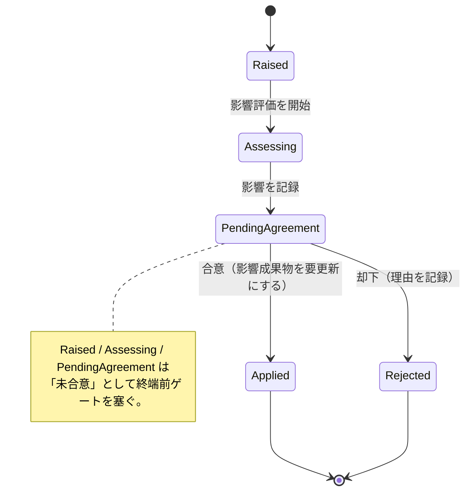
```mermaid
stateDiagram-v2
  [*] --> Raised
  Raised --> Assessing : 影響評価を開始
  Assessing --> PendingAgreement : 影響を記録
  PendingAgreement --> Applied : 合意（影響成果物を要更新にする）
  PendingAgreement --> Rejected : 却下（理由を記録）
  Applied --> [*]
  Rejected --> [*]

  note right of PendingAgreement
    Raised / Assessing / PendingAgreement は
    「未合意」として終端前ゲートを塞ぐ。
  end note
```

### 15.5 保守運用サイクル（周期）

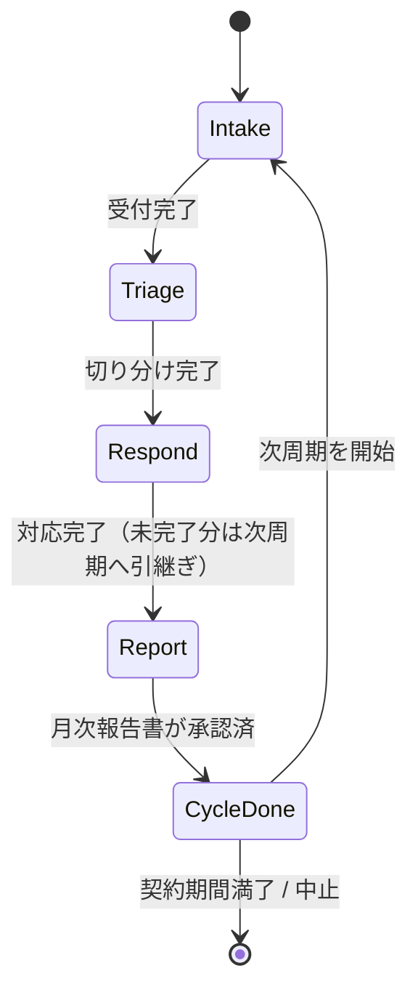
```mermaid
stateDiagram-v2
  [*] --> Intake
  Intake --> Triage : 受付完了
  Triage --> Respond : 切り分け完了
  Respond --> Report : 対応完了（未完了分は次周期へ引継ぎ）
  Report --> CycleDone : 月次報告書が承認済
  CycleDone --> Intake : 次周期を開始
  CycleDone --> [*] : 契約期間満了 / 中止
```

---

## 16. ユースケース図

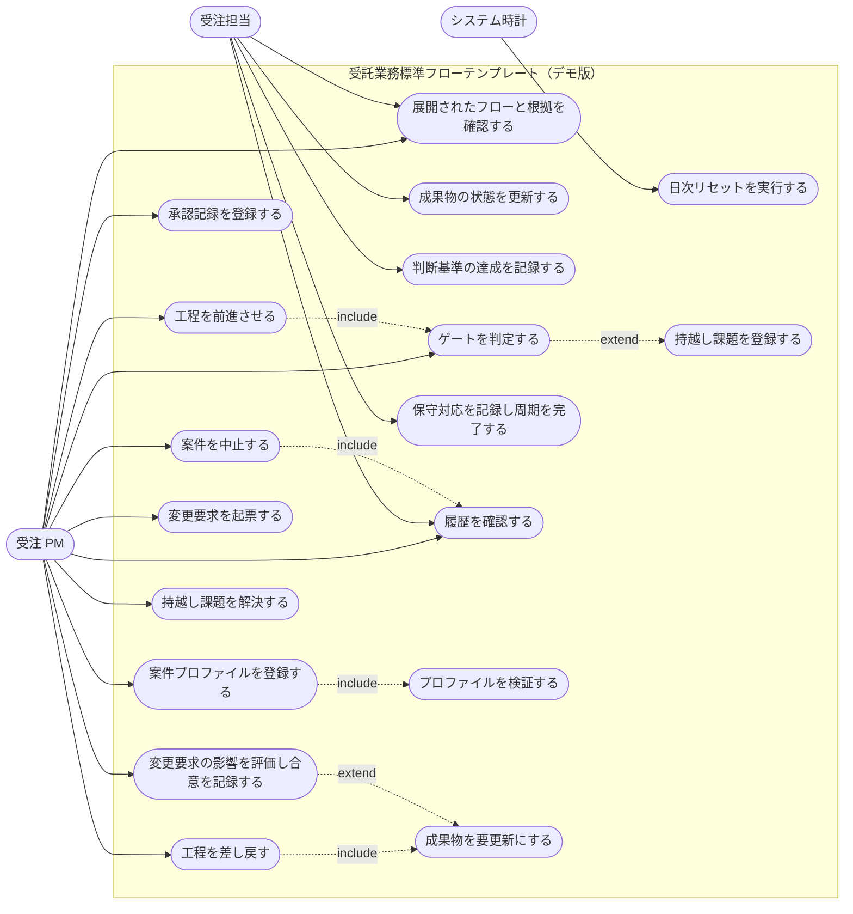
```mermaid
flowchart LR
  PM(["受注 PM"])
  ST(["受注担当"])
  CK(["システム時計"])

  subgraph SYS["受託業務標準フローテンプレート（デモ版）"]
    U1(["案件プロファイルを登録する"])
    U2(["展開されたフローと根拠を確認する"])
    U3(["成果物の状態を更新する"])
    U4(["判断基準の達成を記録する"])
    U5(["承認記録を登録する"])
    U6(["ゲートを判定する"])
    U7(["工程を前進させる"])
    U8(["工程を差し戻す"])
    U9(["案件を中止する"])
    U10(["変更要求を起票する"])
    U11(["変更要求の影響を評価し合意を記録する"])
    U12(["持越し課題を解決する"])
    U13(["保守対応を記録し周期を完了する"])
    U14(["履歴を確認する"])
    U15(["日次リセットを実行する"])
    U16(["プロファイルを検証する"])
    U17(["持越し課題を登録する"])
    U18(["成果物を要更新にする"])
  end

  PM --> U1
  PM --> U2
  PM --> U5
  PM --> U6
  PM --> U7
  PM --> U8
  PM --> U9
  PM --> U10
  PM --> U11
  PM --> U12
  PM --> U14
  ST --> U2
  ST --> U3
  ST --> U4
  ST --> U13
  ST --> U14
  CK --> U15

  U1 -.->|"include"| U16
  U7 -.->|"include"| U6
  U6 -.->|"extend"| U17
  U8 -.->|"include"| U18
  U11 -.->|"extend"| U18
  U9 -.->|"include"| U14
```

---

## 17. 非機能要件

| 区分 | 要件 |
|---|---|
| 実装方式 | 1 issue のワンショットで実装する |
| 外部通信 | 外部サービスへのネットワーク越しの呼び出しを行わない。資格情報を必要とする通信を持たない |
| 決定性 | 同一プロファイルから同一フローを展開すること。派生規則の適用順を固定すること |
| 整合性 | 状態更新・判定・遷移は案件単位で直列化し、同一案件への同時操作で状態が矛盾しないこと |
| 追跡性 | 工程・成果物・判断基準の生成根拠、判定結果、遷移、変更要求の全てを履歴から辿れること |
| 表示 | フロー全体図は 1 画面で全工程を俯瞰でき、工程数の最大（規模＝大・ハイブリッド・改修）でも横スクロールなしに収まること |
| 応答 | フローの展開と判定は同期処理で完結し、バックグラウンド処理を持たないこと |

---

## 18. セキュリティ・個人情報

**セキュリティ**

- 認証・認可を設計に組み込まない
- セッション管理（Cookie ＋ SQLite）を用い、セッションキーをオーナーキーとして全テーブルに付与する
- セッションをまたいだ DB レコードの参照・操作を行えないこと。案件 ID を知っていてもセッションキーが一致しなければ到達できないこと
- Bot 対策はハニーポット方式で行う。プロファイル入力・変更要求起票の各フォームに不可視の入力欄を設け、値が入っている送信は受理しない。reCAPTCHA を用いない
- 入力値はマスタの区分値と照合し、区分外の値を持つ要求は受理しないこと

**個人情報**

| 項目 | 扱い |
|---|---|
| 氏名・ニックネーム | 使用しない。責任主体はロール（受注 PM・受注担当・発注者窓口・発注者決裁者）で表す |
| メールアドレス | 使用しない |
| 生年月日・住所・電話番号 | 使用しない |
| 顧客名 | 使用しない。案件ラベルは任意の識別用文字列とし、実在の顧客名・個人名を含めないよう画面で案内する |
| セッションキー | 端末識別子として扱う |

---

## 19. 運用要件

| 項目 | 内容 |
|---|---|
| DB | SQLite（D1）。デプロイ先を問わず SQLite を用いる |
| 日次リセット | JST 03:00 に全テーブルを削除する。Cron Triggers で実行する |
| マスタ | 工程・成果物・判断基準・派生規則はアプリケーションに同梱し、リセットの対象外とする |
| 測定 | 行わない |
| 保守・監視 | 行わない |

---

## 20. 対応環境と制約

| 項目 | 内容 |
|---|---|
| 対応ブラウザ | 最新世代のデスクトップ向けブラウザおよびモバイルブラウザ |
| 対応端末 | デスクトップを主とし、モバイルではフロー全体図を縦並びで表示する |
| データの寿命 | 日次リセットにより、登録した案件は当日限りで消去される。その旨を画面に常時表示する |
| 前提 | テンプレート（マスタ）は固定であり、利用者による編集を受け付けない |
